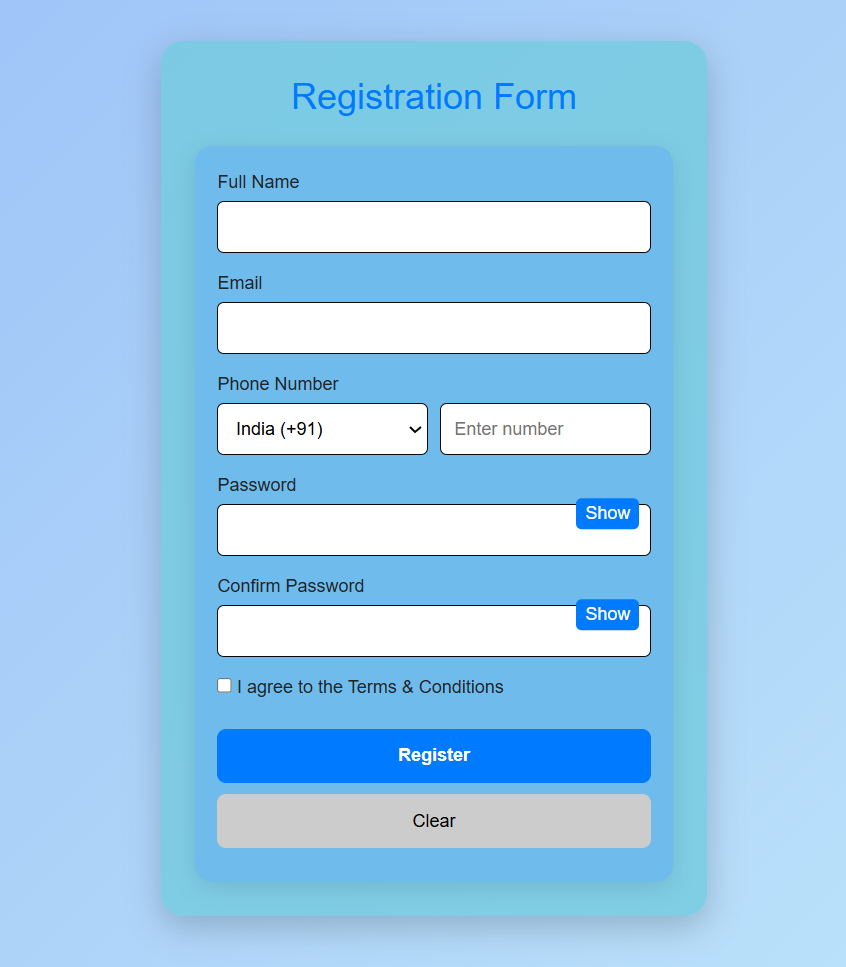

# Registration Form Project

## Overview
This is a modern registration form built using HTML, CSS, JavaScript, and Bootstrap. Features include input validation, password strength indicator, show/hide password, terms & conditions validation, and responsive card layout.

**Live Demo:** [Insert your Netlify link here]

## Features
- Full Name, Email, Phone Number, Password, and Confirm Password
- Country code selection for phone number
- Real-time validation with visual feedback
- Password strength indicator
- Show/Hide password toggle
- Terms & Conditions checkbox validation
- Clear/Reset button
- Responsive and modern UI


# 🛠 Tech Stack

- **HTML5** – Form structure
- **CSS3** – Styling & layout
- **JavaScript (Vanilla JS)** – Validation logic


## File Structure
Major/
├── style/
│   └── styles.css
├── javascripts/
│   └── app.js
├── index.html
└── README.md

## ⚙️ Validation Rules

| Field           | Validation Applied |
|----------------|-------------------|
| Name            | Cannot be empty |
| Email           | Must follow valid email format |
| Password        | Minimum 6 characters |
| Confirm Password| Must match password |
| All Fields      | Required |

---

## How to Use
1. Fill all required fields.
2. Check the Terms & Conditions checkbox.
3. Click Register to submit the form.
4. Use Clear to reset all fields.

## Notes
- Only **Bootstrap CSS** is used. No external JS libraries.
- Keep sensitive data out; this is a frontend demo.
- Comments in JS/CSS are encouraged.
- Input validations are implemented in JS.


## ▶️ How to Run the Project

1. Clone the repository:
   ```bash
   git clone https://github.com/bikeesah/Form-Validation.git
Navigate to the project folder:

bash
Copy code
cd Form-Validation
Open index.html in your browser
OR use Live Server in VS Code.

📸 Screenshot (Optional)


🎯 Learning Outcomes
Client-side form validation

JavaScript DOM manipulation

Handling user input events

Displaying dynamic error messages

Writing clean & structured JS logic


📌 Future Enhancements
Regex-based strong password validation

Backend validation integration

Show/Hide password feature

Form submission using API

Dark mode support


🤝 Contributing
Contributions are welcome!
Fork the repository and submit a pull request to improve this project.


## License
Open source for educational purposes.


👤 Author
Bikee Kumar Sah
GitHub: https://github.com/bikeesah


